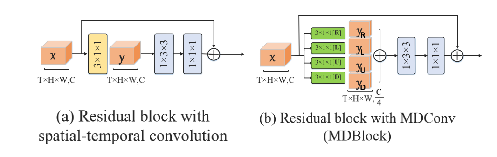

# MULTI-DIRECTIONAL CONVOLUTION
## 1 Paper Details
B. Yang, Z. Wang, W. Ran, H. Lu and Y. -P. P. Chen, "Multi-Directional Convolution Networks with Spatial-Temporal Feature Pyramid Module for Action Recognition," ICASSP 2021 - 2021 IEEE International Conference on Acoustics, Speech and Signal Processing (ICASSP), 2021, pp. 2440-2444, doi: 10.1109/ICASSP39728.2021.9413610. [[ICASSP 2021]](https://ieeexplore.ieee.org/abstract/document/9413610)

The following pictures are examples of spatial-temporal motion decomposition and residual block with MDConv,respectively.
<div align="center">
    
</div>
<div align="center">
    
</div>

## 2 Usage
### 2.1 Install C++ Extension
```shell
cd mdconv
python setup.py install
```
### 2.2 Import Package 
```python
import mdconv
```
### 2.3 Example
```python
# You can copy MDConvFunction, DirectionalConv and MDConv, and use MDConv instead of Conv3d.
self.conv = MDConv(in_channels, out_channels, stride=1, bias=False)
# forward
out = self.conv(x)
```